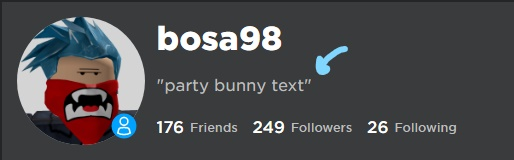

# Verify

## How to get verified?

You can use the verify command in the following way to start verifying: 

```
s!verify
```

Once you use the command the bot will look for any info about you in known API's if you were found in any of them the bot will ask you if you want to use that account. If you agree to use it then congratulations 🎉 you have been verified successfully. If you didn't keep on reading...


If it shows an old name then please decline it and re-verify to make sure you don't have any old information in the system


In case the bot has found wrong information or you are re-verifying then you will be following the next steps:

1. The bot will ask for your Roblox username
2. The bot will provide you with a code that you will need to put in your Roblox profile status to make sure that it's you who is using the account  



    3. After you add the code to your profile status react to the message with ✅   
    4. The bot will then check for your profile status.  
        If it is found: congratulations 🎉 You have been verified successfully  
        If it isn't then you have probably done something wrong please re-do the  
        procedure again

### How to change the Roblox account bound to your discord account?

You can change it using: 

```text
s!verify change
```


